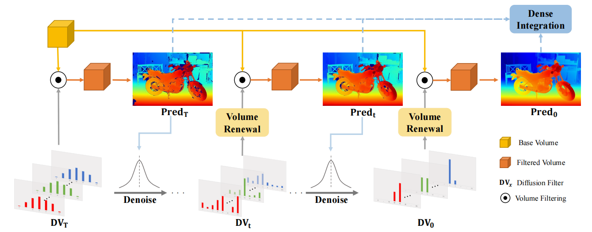
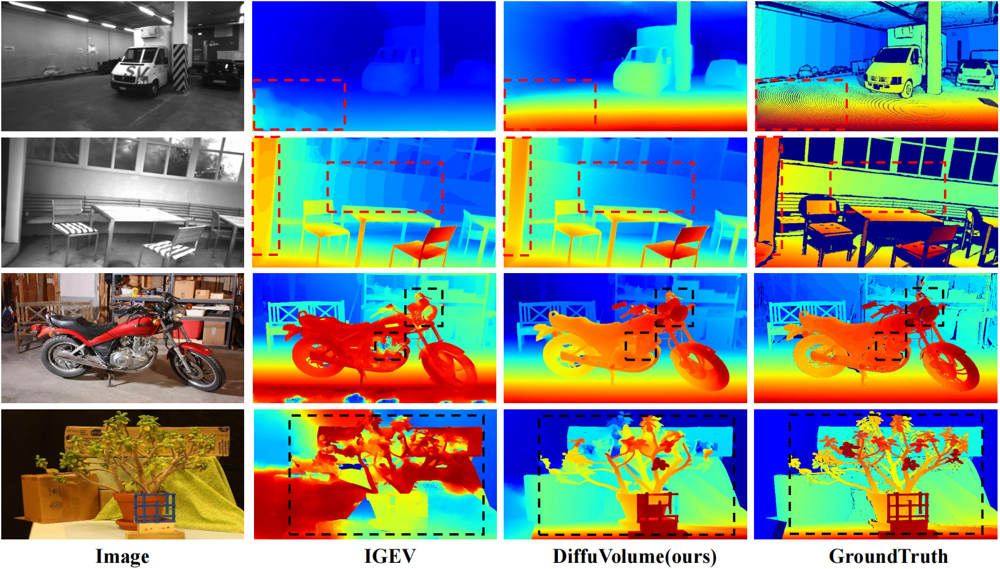

## DiffuVolume: Diffusion Model for Volume based Stereo Matching <br><sub>Official PyTorch Implementation of DiffuVolume. </sub>

[Paper](https://arxiv.org/pdf/2308.15989.pdf) | [Personal HomePage](https://zhengdian1.github.io)

### Updates
[**2025.01.15**] 🎉🎉🎉 DiffuVolume is finally accepted by IJCV2025 after a long wait! 🎉🎉🎉 <br>
[**2024.05.06**] We refine our code for better user experience <br>
[**2024.03.17**] The **pretrained weights** of DiffuVolume are released in [link1](https://drive.google.com/drive/folders/1aCmW6-MBBkvJ4pQ3_AchxzzrezHmArEp?usp=drive_link) <br>
[**2024.03.16**] The **whole training and testing codes** are released!!! <br>
[**2023.08.31**] Our DiffuVolume paper is submitted to IJCV <br>

## Introduction

Cost Volume-based stereo matching methods need to build a redundant cost volume, which interferes with the model training and limitting the performance. In this work, we build a volume filter based on diffusion model, named DiffuVolume, which only uses the diffusion algorithm but not the heavy U-Net network to iteratively remove the redundant information in the cost volume. By adding the DiffuVolume into well-performed methods, we outperform all the published volume-based methods on Scene Flow, KITTI and zero-shot benchmarks.

### Training Framework

### Inference Framework


# How to use

## Environment
* Python 3.8
* Pytorch 2.0

## Install

### Create a virtual environment and activate it.

```
conda create -n diffuvolume python=3.8
conda activate diffuvolume
```
### Dependencies

```
conda install pytorch torchvision torchaudio cudatoolkit=11.3 -c pytorch -c nvidia
pip install opencv-python
pip install scikit-image
pip install tensorboard
pip install matplotlib 
pip install tqdm
```

## Data Preparation
Download [Scene Flow Datasets](https://lmb.informatik.uni-freiburg.de/resources/datasets/SceneFlowDatasets.en.html), [KITTI 2012](http://www.cvlibs.net/datasets/kitti/eval_stereo_flow.php?benchmark=stereo), [KITTI 2015](http://www.cvlibs.net/datasets/kitti/eval_scene_flow.php?benchmark=stereo)

## Train
Our DiffuVolume is a plug-and-play module for existing volume-based methods. Here we show the code trained on Scene Flow, KITTI2012, and KITTI2015

Scene Flow (using pretrained model on ACVNet)
```
cd SceneFlow
python main.py
```

KITTI2012 (using pretrained model on PCWNet)
```
cd KITTI12
python main.py
```

KITTI2015 (using pretrained model on IGEV-Stereo)
```
cd KITTI15
sh run.sh
```

## Test and Visualize
Scene Flow
```
cd SceneFlow
python test_sceneflow_ddim.py
python save_disp_sceneflow.py
```

KITTI2012
```
cd KITTI12
python test.py
python save_disp_sceneflow_kitti12.py
```

KITTI2015
```
cd KITTI15
sh run.sh
python save_disp.py
```


## Results on KITTI 2015 leaderboard
[Leaderboard Link 2015](https://www.cvlibs.net/datasets/kitti/eval_scene_flow.php?benchmark=stereo&eval_gt=noc&eval_area=all)

| Method | D1-bg (All) | D1-fg (All) | D1-all (All) | Runtime (s) |
|:-:|:-:|:-:|:-:|:-:|
| DiffuVolume | 1.35 % | 2.51 % | 1.54 % | 0.18 |
| IGEV | 1.38 % | 2.67 % | 1.59 % | 0.18 |
| ACVNet | 1.37 % | 3.07 % | 1.65 % | 0.20 |
| GwcNet | 1.74 % | 3.93 % | 2.11 % | 0.32 |
| PSMNet | 1.86 % | 4.62 % | 2.32 % | 0.41 |

## Comparison with traditional diffusion based stereo matching

| Method | EPE (px) | Bad1.0 | Runtime (s) | Params (M) |
|:-:|:-:|:-:|:-:|:-:|
| DiffuVolume | 0.46 | 4.97 % | 1.11 | 7.23 |
| DDPM | 0.59 | 6.06 % | 265 | 60.07 |
| DDIM | 0.63 | 6.13 % | 1.21 | 60.07 |

## Qualitative results on ETH3D and Middlebury

### We show the zero-shot generalization results of our DiffuVolume compared with current SOTA methods IGEV.



# Citation

If you find this project helpful in your research, welcome to cite the paper.

```
@article{zheng2023diffuvolume,
  title={DiffuVolume: Diffusion Model for Volume based Stereo Matching},
  author={Zheng, Dian and Wu, Xiao-Ming and Liu, Zuhao and Meng, Jingke and Zheng, Wei-shi},
  journal={arXiv preprint arXiv:2308.15989},
  year={2023}
}

```

# Acknowledgements

Thanks to Gangwei Xu for opening source of his excellent works ACVNet and IGEV-Stereo. Our work is inspired by these works and part of codes are migrated from [ACVNet](https://github.com/gangweiX/ACVNet), [IGEV](https://github.com/gangweiX/IGEV). <br>
Thanks to Zhelun Shen for opening source of his excellent works PCWNet. Our work is inspired by this work and part of codes are migrated from [PCWNet](https://github.com/gallenszl/PCWNet).

# Contact

Please contact Dian Zheng if there are any questions (1423606603@qq.com or zhengd35@mail2.sysu.edu.cn).
